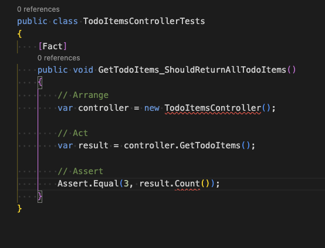

# Add unit tests with Duet AI

Next, let's see if Duet AI can help us to add unit tests.

First, let's refresh our memories about the unit test frameworks in C#.

**Prompt**
> What unit testing frameworks exist for ASP.NET apps?

**Answer**
> There are a number of unit testing frameworks available for ASP.NET apps. Some of the most popular include:

> xUnit: xUnit is a free and open source unit testing framework for .NET. It is based on the xUnit unit testing framework for Java. xUnit is a popular choice for ASP.NET apps because it is easy to use and has a large community of users and contributors.

> NUnit: NUnit is a free and open source unit testing framework for .NET. It is based on the JUnit unit testing framework for Java. NUnit is a popular choice for ASP.NET apps because it is powerful and has a large community of users and contributors.

> MSTest: MSTest is a built-in unit testing framework for Visual Studio. It is a good choice for ASP.NET apps because it is easy to use and integrates well with Visual Studio.

> In addition to these three frameworks, there are a number of other unit testing frameworks available for ASP.NET apps. Some of these include FluentAssertions, Shouldly, and AssertJ.

> The best unit testing framework for your ASP.NET app will depend on your specific needs and preferences. If you are new to unit testing, xUnit or NUnit are a good place to start. If you are more experienced with unit testing, MSTest or one of the other more powerful frameworks may be a better choice.

This is a pretty good answer! Continue with more questions.

***Prompt***
> How can I create a new xUnit project for unit tests for `TodoItemsController.cs` from the command line? I want the project in ToDoApiTest folder

**Answer**
> To create a new xUnit project for unit tests for` TodoItemsController.cs `from the command line, you can use the following steps:

* Open a terminal window.
* Navigate to the ToDoApiTest folder.
* Run the following command:

```sh
dotnet new xunit
```

> This will create a new xUnit project with the name UnitTest1.

> Open the` UnitTest1.csproj` file in a text editor. Add the following code to the file:

```csharp
using TodoApi.Controllers;
using Xunit;

namespace TodoApi.Tests;

public class TodoItemsControllerTests
{
    [Fact]
    public void GetTodoItems_ShouldReturnAllTodoItems()
    {
        // Arrange
        var controller = new TodoItemsController();

        // Act
        var result = controller.GetTodoItems();

        // Assert
        Assert.Equal(3, result.Count());
    }
}
```

This answer is pretty good! You can generate a new test project however, there are some issues.

Duet AI is telling us to add code to the project file, `UnitTest1.csproj` instead
of `UnitTest1.cs`. You an go ahead and rename `UnitTest1.cs` to `ToDoItemsControllerTests.cs` and added the suggested code.

Secondly, `ToDoItemsController` is another project, so we need to refer to the other project from the test project.

Here comes another question to Duet AI:

**Prompt**
> How can I change the project file `ToDoApiTest.csproj` to refer to the `TodoItemsController` class in the other project `ToDoApi.csproj`?

**Answer**
> To change the project file `ToDoApiTest.csproj` to refer to the `TodoItemsController` class in the other project ToDoApi.csproj, you can use the following steps: [1]

* Open the ToDoApiTest.csproj file in a text editor.
* Find the line that references the TodoItemsController class.
* Change the path to the TodoItemsController class to the path in the ToDoApi.csproj file.
* Save the ToDoApiTest.csproj file.
* Here is an example of how you would change the project file ToDoApiTest.csproj
  to refer to the TodoItemsController class in the other project ToDoApi.csproj:

```csharp
<Project Sdk="Microsoft.NET.Sdk.Web">

  <PropertyGroup>
    <TargetFramework>net6.0</TargetFramework>
    <Nullable>enable</Nullable>
  </PropertyGroup>

  <ItemGroup>
    <ProjectReference Include="..\ToDoApi\ToDoApi.csproj" />
  </ItemGroup>

  <ItemGroup>
    <Controller Include="Controllers\TodoItemsController.cs" />
  </ItemGroup>

</Project>
```

While the answer is not perfect (`Controller Include` is wrong and not needed),
it gives you what you need, just copy the `ProjectReference Include` to your testing
project (see [TodoApiTest.csproj](../after/TodoApiTest/TodoApiTest.csproj))

Now, the generated testing code is still not compiling:



You need a mocked DB context for the controller.

**Prompt**
> How can I have a mocked TodoContext for xunit testing?

**Answer**
> To have a mocked TodoContext for xunit testing, you can use the following steps:

* Create a new class that inherits from the TodoContext class.
* In the new class, override the OnConfiguring method and provide a fake connection string.
* In the new class, override the OnModelCreating method and provide a fake model builder.
* Create a new instance of the new class and use it in your xunit tests.
* Here is an example of how you would create a mocked TodoContext for xunit testing:

```csharp
using Microsoft.EntityFrameworkCore;
using TodoApi.Models;

public class MockedTodoContext : TodoContext
{
    public MockedTodoContext()
        : base(new DbContextOptionsBuilder<TodoContext>()
            .UseInMemoryDatabase("TodoApi")
            .Options)
    {
    }

    protected override void OnConfiguring(DbContextOptionsBuilder optionsBuilder)
    {
        optionsBuilder.UseInMemoryDatabase("TodoApi");
    }

    protected override void OnModelCreating(ModelBuilder modelBuilder)
    {
        modelBuilder.Entity<TodoItem>().ToTable("TodoItems");
    }
}
```

The answer is pretty good and actually works! You can now go back to the
[TodoItemsControllerTests.cs](../after/TodoApiTest/TodoItemsControllerTests.cs)
and change it to have the basic unit test:

```csharp
    [Fact]
    public void GetTodoItems_ShouldNotReturnNull()
    {
        // Arrange
        var controller = new TodoItemsController(new MockedTodoContext());

        // Act
        var result = controller.GetTodoItems();

        // Assert
        Assert.NotNull(result);
    }
```

**Lessons learned**:

* The  more specific you get, the better will be the answers (eg. Don’t say ‘How can I test?’ but rather say ‘How can I create a xUnit project to unit test TodoItemsController.cs class from command line”
* Duet AI will tell you to generate code in wrong places sometimes. You need to know your way around in code to know where the code should go.
