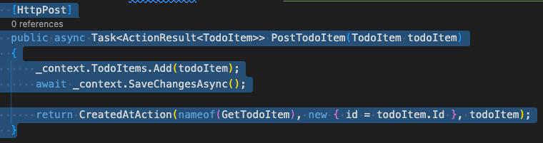

# Test code with Duet AI

Next, let's see if Duet AI can help us to test the code.

Highlight the [PostTodoItem()](https://github.com/meteatamel/duetai-aspnet-webapi/blob/main/before/TodoApi/Controllers/TodoItemsController.cs#L73) method in TodoItemsController.cs:



Ask the following:

**Prompt**
> Can you help me test this highlighted code with curl? The server is running on port 5112

**Answer**
> Sure. To test the highlighted code with curl, you can use the following command:

```sh
curl -X POST \
    -H "Content-Type: application/json" \
    -d '{
        "name": "Learn ASP.NET Core",
        "description": "Build a web API with ASP.NET Core",
        "priority": 4,
        "done": false
    }' \
    http://localhost:5112/api/TodoItems
```

> This command will send a POST request to the api/TodoItems endpoint on the server, with the body of the request containing the JSON representation of a new TodoItem object. The server will then create the new TodoItem and return a response with the status code 201 Created.

> You can then use the curl command to get the newly created TodoItem by using the following command:

```sh
curl http://localhost:5112/api/TodoItems/1
```

> This command will send a GET request to the api/TodoItems/1 endpoint on the server, and the server will return a response with the status code 200 OK and the body of the response containing the JSON representation of the newly created TodoItem.

As you can see, the command works but it isn’t correct. `ToDoItem.cs` contains
`id`, `name`, and `isComplete` fields. Duet AI got the name correctly but the
rest was not correct.

WE need a more specific prompt.

**Prompt**
> Can you try generating the curl command, taking `ToDoItem.cs` into account?

**Answer**
> Sure. The following command will send a POST request to the api/TodoItems endpoint on the server, with the body of the request containing the JSON representation of a new TodoItem object:

```sh
curl -X POST \
    -H "Content-Type: application/json" \
    -d '{
        "name": "Learn ASP.NET Core",
        "isComplete": false
    }' \
    http://localhost:5112/api/TodoItems
```

> This command will create a new TodoItem with the name "Learn ASP.NET Core" and the value of IsComplete set to false.

This time the answer was correct!

**Lessons learned**:

* You need to direct Duet AI to the right answer sometimes with your knowledge of the code.
