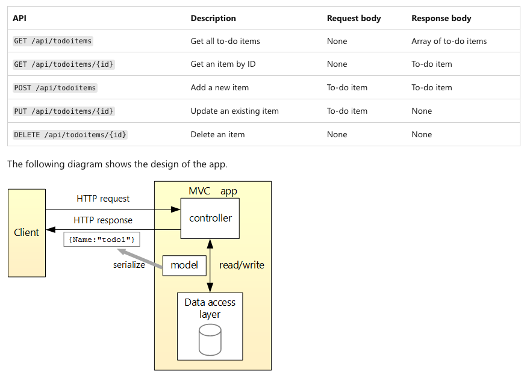
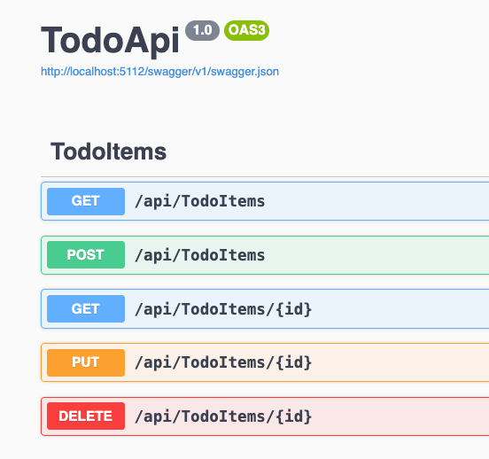

# Todo list app

For the application, you can go through the [Tutorial: Create a web API with ASP.NET
Core](https://learn.microsoft.com/en-us/aspnet/core/tutorials/first-web-api?view=aspnetcore-8.0&WT.mc_id=dotnet-35129-website&tabs=visual-studio-code)
to create a Todo list app with MVC architecture and a web API.



Or, you can start with the finished tutorial app in [before](./before/) folder.

Check that you can run the application:

```sh
cd before/TodoApi
dotnet run
```

You should see the app running:

```sh
Building...
info: Microsoft.Hosting.Lifetime[14]
      Now listening on: http://localhost:5112
info: Microsoft.Hosting.Lifetime[0]
      Application started. Press Ctrl+C to shut down.
```

You can also interact with the app with Swagger/OpenAPI endpoint at
`http://localhost:5112/swagger/`:


